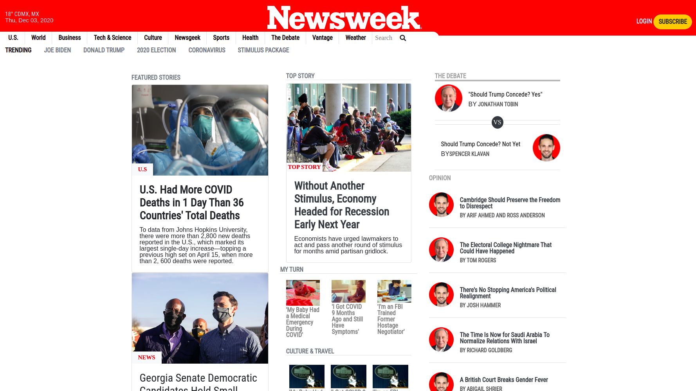

# Newsweek-Clone

> This project aims to build a responsive website using bootstrap




It is a nicely done layout for Newsweek Clone using flexbox, bootstrap and a nice touch of position sticky!

## Built With

- HTML5
- CSS
- Bootstrap
- Github Pages
- Linters
- FontAwesome

## Live Demo

[Live Demo Link](https://rawcdn.githack.com/angelacuahutle/Newsweek-Clone/e27c791dbd6b028b6caf9457a75cfefb70f999bc/index.html)

## Authors

👤 **Angela Cuahutle**

- GitHub: [@angelacuahutle](https://github.com/angelacuahutle)
- Twitter: [@AngelaCunaDev](https://twitter.com/AngelaCunaDev)

## Issues 🤝 

Contributions, issues, and feature requests are welcome!

Feel free to check the [issues page](https://github.com/angelacuahutle/Newsweek-Clone/issues).

## Show your support

Give a ⭐️ if you like this project!

## 📝 License

This project is [MIT](./LICENSE) licensed.


# Learnings of this project

- ```Ctrl + Shift + I``` command for auto-indentation.